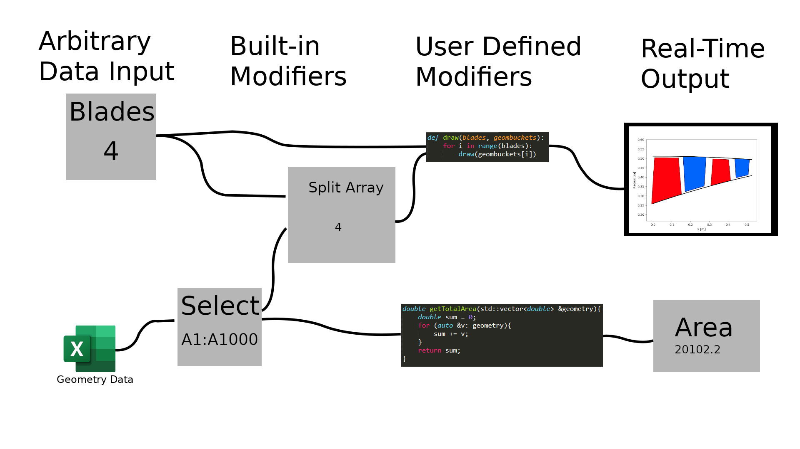

# EngFlow

EngFlow is a dataflow suite specialised for arbitrary code execution and live results. Currently unstable, breaking changes frequent. 
Probable change of name will be required due to existing products.

# Design Goals
Node based dataflow editing
Cross platform (assuming prerequisites are installed)
Plugins
Codeblocks of any language
External language bindings
Decent Performance with large datasets

# Progress
- [x] Modular Behavior Blocks
- [x] File Loader/Saver
- [ ] Dataflow/tree based program solver/runner
- [ ] Plugins
- [ ] GUI Editor

## Language Blocks Progress
- Python (3.8)
  - [x] Binding (Python)
  - [x] Compiler (Python)
  - [x] Runtime (Python)
  - [x] Reflection ([inspect.signature](https://docs.python.org/3/library/inspect.html#inspect.signature))
- Lua (5.3)
  - [x] Binding ([Sol2](https://github.com/ThePhD/sol2))
  - [x] Compiler (Lua)
  - [x] Runtime (Lua)
  - [ ] Reflection (???)
- Javascript
  - [ ] Binding (V8)
  - [ ] Compiler (V8)
  - [ ] Runtime (V8)
  - [ ] Reflection (???)
- Java
  - [x] Binding (JNI)
  - [x] Compiler (javac)
  - [ ] Runtime (JNI)
  - [ ] Reflection (???)
- MATLAB
  - [ ] Binding (mex)
  - [ ] Compiler (???)
  - [ ] Runtime (may be same as C/C++???)
  - [ ] Reflection (???)
- Maple
  - [ ] Binding (OpenMaple)
  - [ ] Compiler (???)
  - [ ] Runtime (OpenMaple)
  - [ ] Reflection (Builtin Decomposition)
- C/C++
  - [ ] Binding (native?)
  - [ ] Compiler (gcc,clang,msvc....)
  - [ ] Runtime (???)
  - [ ] Reflection (??????)

  Note: These are being implemented in order of ease of implementation, not based on language usefullness, security, my own skill in said language, or any other redeeming qualities. If you have a strong opinion about a language that is not yet implmented, a language not listed here, or any comments of how some of these implementations poor quality (Like my haphazard treatment of python reference counting), feel free to send a pull request, this project has a huge scope and I don't even know where to begin on most of this.

# Code Guidelines
- Everything is subject to change, so account for that somehow lol.
- Everything is made with cmake, submodules are allowed with justification.
- This is intended to be cross-platform, however for now it must at a minimum work on Windows.
- This is done in C++2a, and depending on what changes come in 2023, (specifically [reflection](http://www.open-std.org/jtc1/sc22/wg21/docs/papers/2020/n4856.pdf), [pattern matching](http://www.open-std.org/jtc1/sc22/wg21/docs/papers/2020/p1371r2.pdf), and possibly [ABI stuff](http://www.open-std.org/jtc1/sc22/wg21/docs/papers/2020/p2123r0.html)) then this might be bumped to C++2b.
- These will take a more structured form as the project develops.

If you have disagreements about this (and you care) you are honestly probably more experienced with this than I am. Let me know your thoughts and your reasoning in an issue.